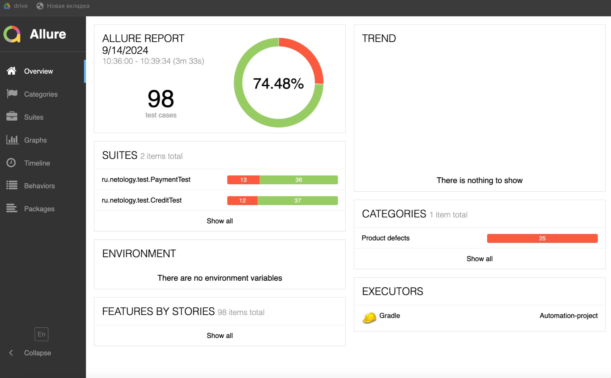
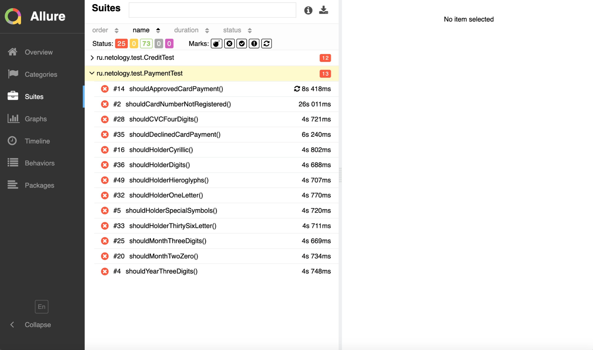
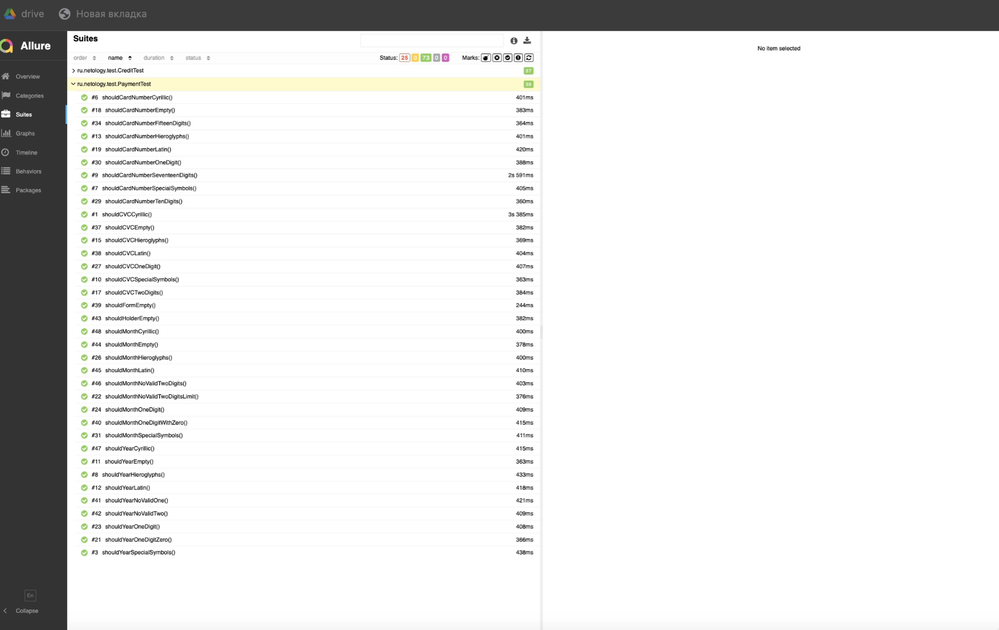
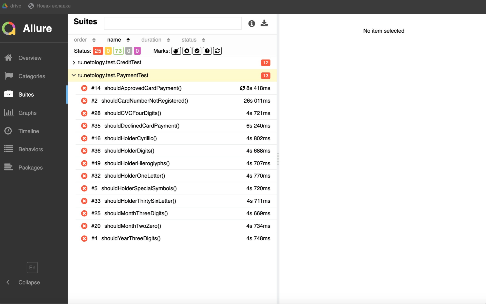
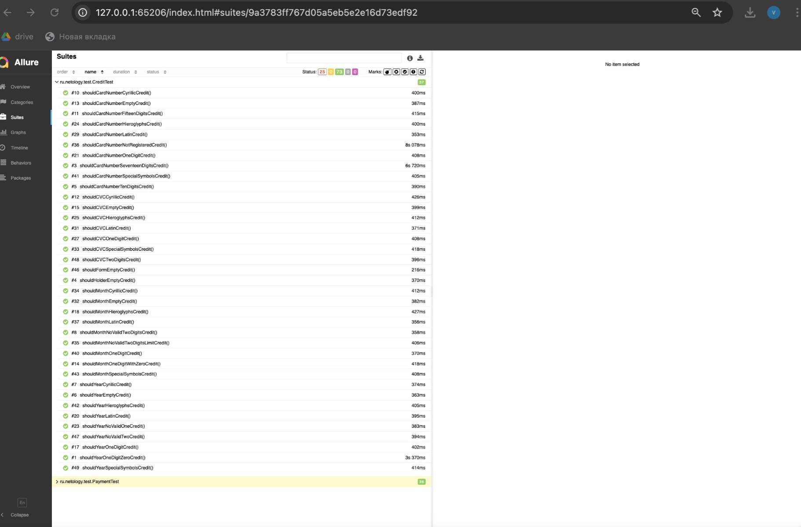

## Отчет по результатам автоматизированного тестирования.

### Краткое описание

В соответствие с [планом]() было проведено автоматизированное тестирование веб-приложения покупки туров "Путешествие дня":
1. В процессе проведения тестирования были реализованы позитивные и негативные сценарии.
2. Тестирование проводилось с использованием двух баз данных: MySQL и PostgreSQL.
3. Протестирована возможность записи информации о платеже в базу данных, а также ее сохранения.

### Тест-кейсы

Общее количество тест-кейсов составило 40 штук:
- Оплата по карте: позитивные - 15, негативные - 5;
- Кредит по данным карты: позитивные - 15, негативные - 5.

### Результаты автоматизированного тестирования

   При подключении к базе данных MySQL:

1. 

2.

3.

4.

5.

- Всего автотестов: 98 тестов;
- Позитивные автотесты: 73 теста;
- Негативные тесты: 25 теста.

Рекомендации по итогам проведенного тестирования:
1. Необходимо составить документацию для приложения.
2. Исправить, выявленные в ходе тестирования, ошибки.
3. Скорректировать текст сообщений полей ввода данных для более понятного их внесения.